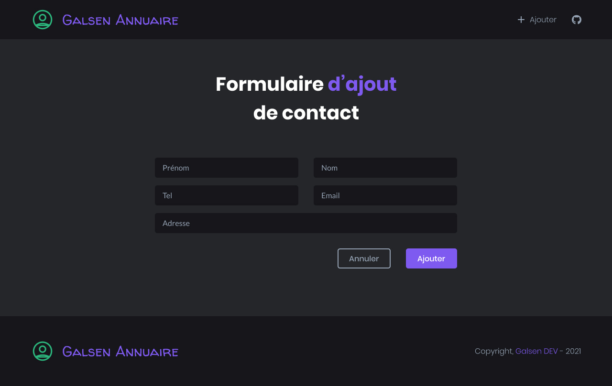
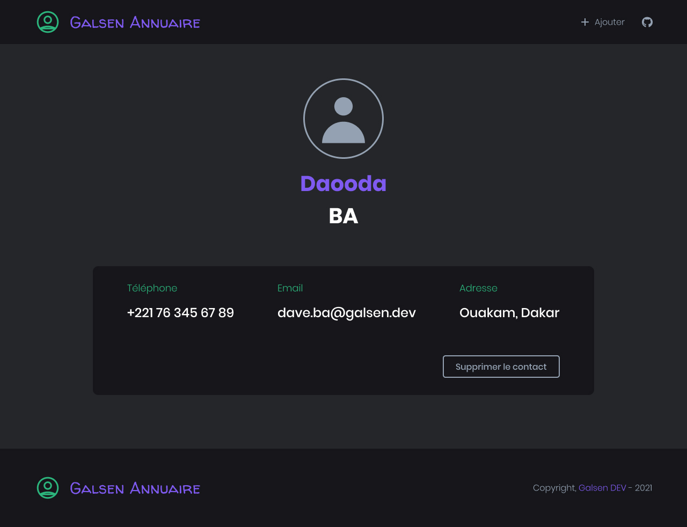
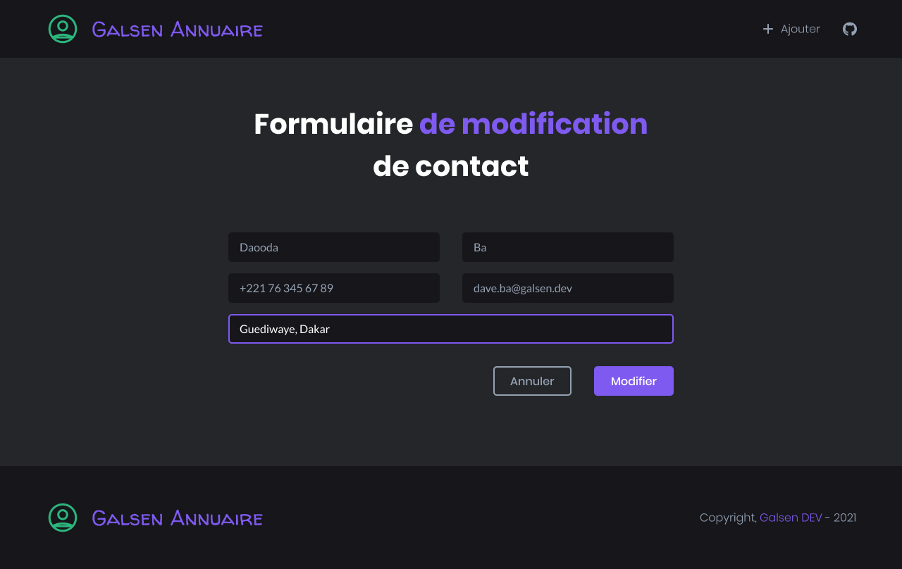

# Live Coding #1 - Annuaire Téléphonique ☎️

Ceci est un petit projet réalisé par des développeurs de la communauté Galsen DEV dans le cadre du **Live Coding Project #1**.

## Contribuer 👏🏽

Si vous souhaitez une contribution, veuillez d'abord **créer une branche** où vous allez y mettre votre code (`git checkout -b nom-de-votre-branche`). Après il vous suffit juste de faire un `git push origin nom-de-votre-branche` pour créer une Pull Request. Il faudra maintenant vous rendre dans le dépôt Github afin de finaliser votre Pull Request.

🛑 Donc s'il vous plait, **créez d'abord une branche** avant de faire un `git push ...`.

## Pré-requis ✔️

- [Composer](https://getcomposer.org/download/) v1.10 ou supérieure
- [MySQL Server](https://dev.mysql.com/downloads/mysql/) v5.7 ou supérieur
- [PHP](https://www.php.net/downloads) v7.4 ou supérieure

## Comment lancer l'application 🚀

Pour le moment, nous utilisons le serveur interne de PHP. Pour démarrer l'application il vous suffit de faire :

```bash
composer update
php build
```

Ouvrez **localhost:4000** sur votre naviguateur pour voir le résultat ✌🏽

### Screenshots 🖼️






### Licence 🚨

Ce projet est sous **[License MIT](LICENSE)**.
