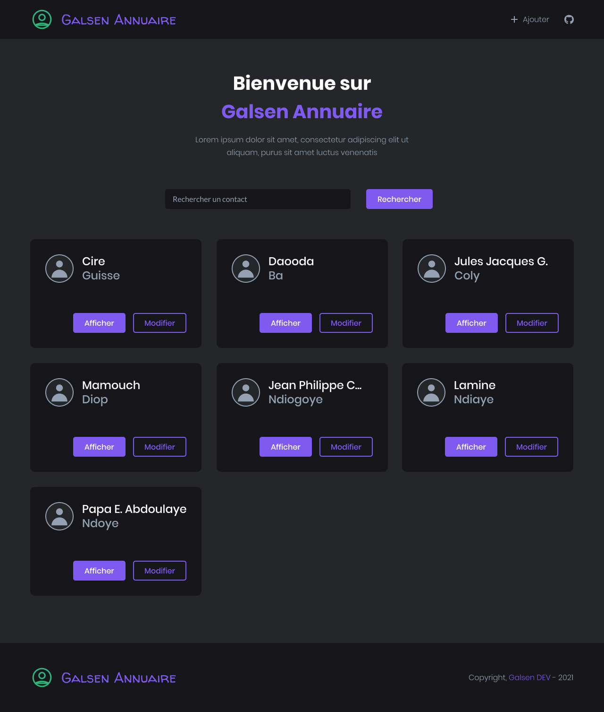

# Maquette du site

Vous pouvez cliquer sur ce [lien](https://www.figma.com/file/Ec6S0sd366zbeUkJMzrmXK/Live-Coding?node-id=14%3A0) pour visionner le fichier Figma. Ce fichier vous permet de visualiser certains éléments comme les différents composants de notre appli, la taille de la police, les couleurs utilisées...

## La palette de couleur

Voici les couleurs utilisées dans ce projet

- **primary** (#16161A): s'applique pour le `background` du
    - footer
    - navbar
    - input
    - card
- **secondary** (#242629): s'applique pour le `background` du
    - body
- **tertiary** (#94A1B2): s'applique pour
    - la `color` des paragraphes
    - le `fill` de l'icone github
    - la `color` du heading correspondant au nom du contact dans le composant `card`
- **white** (#FFFFFE)
- **accent-1** (#7F5AF0)
- **accent-2** (#2CB67D)
- **accent-3** (#D90000)

## La typographie

Pour ce projet, la police utilisée est [Poppins](https://fonts.google.com/specimen/Poppins). Voici les différents `font-weight`

- Light **300** : au niveau des *liens* et des *paragraphes*
- Medium **500** : au niveau des *boutons* et des *h2*
- Bold **700** : au niveau du *h1*
